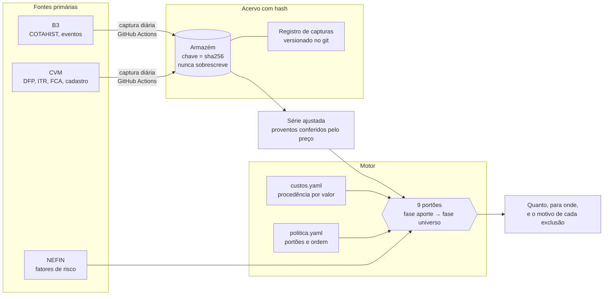

<div align="center">

# MEOL

**Um sistema de análise e aporte em que cada número diz de onde veio.**

Inspirado no método do [Bastter.com](https://bastter.com), sem vínculo com o site.
Adota a disciplina do método e diverge em pontos documentados, um a um, em
[O que o MEOL adota e onde diverge](docs/divergencias-do-metodo.md).

[](https://github.com/OsvaldoSantana/meol/actions/workflows/testes.yml)
[](https://github.com/OsvaldoSantana/meol/actions/workflows/captura_cvm.yml)

[](LICENSE)
[](LICENSE-DOCS)

[O que é](#o-que-é) · [As sete doutrinas](#as-sete-doutrinas) · [Como funciona](#como-funciona) · [Rodar](#rodar) · [Auditar um número](#auditar-um-número) · [Mapa](#mapa-do-repositório) · [Licença](#licença)

</div>

---

## O que é

A cada aporte, o sistema diz **quanto** vai **para onde**, com **procedência em cada
número**: de onde ele veio, quem escolheu a regra, e o que aconteceria se a escolha fosse
outra.

O que ele **não** é:

- **Não é um otimizador.** DeMiguel, Garlappi & Uppal (2009) testaram 14 modelos de
  otimização de carteira, e nenhum bateu a divisão igual (1/N) fora da amostra. Aqui as
  regras são declaradas e testáveis, nunca um ótimo derivado.
- **Não é um backtest rodando atrás de um resultado.** As hipóteses são
  **pré-registradas**, com ordem de execução e orçamento de testes, antes de o dado ser
  tocado. O histórico público deste repositório é o verificador externo.
- **Não é recomendação de investimento.** É um sistema pessoal, publicado para ser lido,
  auditado e reaproveitado.

> **Idioma.** O projeto é escrito em português. Código e YAML ficam em ASCII, sem acento,
> por convenção; a prosa usa acentuação normal.

## As sete doutrinas

Código que viola uma delas está errado mesmo com os testes passando. O texto completo, com
os erros que deram origem a cada uma, está em [`CLAUDE.md`](CLAUDE.md#2-as-sete-doutrinas).

| | doutrina | na prática |
|---|---|---|
| **P1** | Procedência por valor, não por bloco | Cada constante carrega `status`, `fonte` e o que ela `bloqueia`. Um cálculo que dependa de valor não confirmado **recusa-se a rodar**, em vez de usar zero. |
| **P2** | Regras como dados | Todo parâmetro vive em YAML versionado. Trocar política é um commit, nunca um deploy. Chave declarada e nunca lida reprova um teste. |
| **P3** | Portões, não pontuação | Nove portões em ordem declarada, e cada eliminação sai com o motivo. Nenhum score agregado esconde qual critério matou o quê. |
| **P4** | Pré-registro com impressão digital | Teses e compromissos têm hash. Reescrever depois do fato é possível, e deixa rastro. |
| **P5** | Limitações declaradas | O que o motor sabe que não modela fica escrito, com a direção do viés e de quem é o limite: do mundo ou ainda não consertado. |
| **P6** | Ausência de critério não é critério de exclusão | Nada sai do universo por falta de régua. O que falta dado perde **peso**, nunca presença, e fica visível com o motivo. |
| **P7** | Rotina que depende de alguém lembrar não é rotina | Todo processo periódico roda sozinho, ou é declarado como limitação. |

## Como funciona



Os portões têm duas fases, porque decidem coisas diferentes. A fase **aporte** decide
*quanto* dinheiro segue (dívida, reserva) e pode encerrar o processo. A fase **universo**
decide *quais* rotas seguem (coerência, custo, tese, compromisso, dominância) e nunca
encerra. A ordem é dado em `alocacao/politica.yaml`, e o motor a itera.

### Onde o projeto está

| marco | o sistema passa a | estado |
|---|---|---|
| **M1** · decidir o aporte | dizer quanto entra, para qual classe e por qual rota, com custo e imposto medidos | pronto |
| **M2** · decidir com dado próprio | ler balanço e evento societário do próprio acervo | em andamento |
| **M3** · decidir o papel | aplicar uma régua de empresa pré-registrada e medida | depende do M2 |
| **M4** · fazer isso sozinho | capturar sem ninguém lembrar, e acusar a falha em vez de escondê-la | captura diária da CVM e da B3 rodando desde 24/09/2026 |

O plano, com a ordem do que falta e o motivo da ordem, está em [`PLANO.md`](PLANO.md).
O que está aberto, com dono, gatilho e classe, está em [`PENDENCIAS.md`](PENDENCIAS.md).

## Rodar

Requer **Python 3.11**. A faixa é fechada de propósito: um resultado pré-registrado só se
reproduz no ambiente que o produziu.

```bash
git clone https://github.com/OsvaldoSantana/meol.git
cd meol
python -m pip install ".[dev,lint,paralelo]"
```

As versões ficam pinadas com `==` num lugar só, o [`pyproject.toml`](pyproject.toml). Para
conferir o ambiente antes de acreditar num número:

```bash
cd alocacao
python ambiente.py          # diz se o que está instalado bate com o que foi declarado
python demo_aporte.py       # o motor de aporte, de ponta a ponta
python cenarios.py          # varredura de cenários
python impacto.py <alvo>    # o que alcança uma constante, função ou campo
```

Os testes, como o CI roda num clone limpo:

```bash
python -m pytest alocacao fase0 auditoria tools -m "not slow and not privado and not acervo"
```

**O que um clone sozinho não roda.** Os testes marcados `slow` leem o acervo de dados de
mercado, com gigabytes do COTAHIST e dos arquivos da CVM. Ele fica num armazém privado e não
vai para o git. Os marcados `acervo` leem os fatores do NEFIN, que também moram só no armazém:
os termos do NEFIN não autorizam redistribuir o arquivo ([nota da fonte](docs/fontes/nefin.md)).
Os marcados `privado` leem a situação financeira real, que também fica fora por desenho. O
comando acima exclui os três pelo marcador. Quem rodar os `slow` sem o acervo
vê pulados os que dependem dele, e `pytest -rs` diz o motivo de cada um.

## Auditar um número

O projeto foi feito para ser conferido, não acreditado. Os caminhos:

- **Uma constante:** abra `alocacao/custos.yaml`. Cada valor traz `status`, `fonte`,
  `acesso`, e `expira` quando envelhece. `python alocacao/impacto.py <nome>` mostra o que
  depende dela.
- **Um pré-registro:** os de [`docs/aprendizado/`](docs/aprendizado/) valem a partir do
  commit em que foram publicados, e o sha256 de cada versão fica registrado nas emendas e no
  `PENDENCIAS.md`. Para conferir: `git show <commit>:<arquivo> | sha256sum`.
- **Um dado de mercado:** todo arquivo capturado tem hash em
  [`docs/acervo/`](docs/acervo/), e o registro de cada observação, inclusive quando nada
  mudou, é commitado pelo robô da captura.
- **Um achado:** [`ACHADOS.md`](ACHADOS.md) traz a medição que o prova e o teste que impede
  a volta. Achado derrubado não some: fica como retratação, com a causa do erro.
- **O processo:** [`docs/metricas/`](docs/metricas/) registra os erros do próprio processo:
  quem achou, qual régua da casa pegaria, e os commits que introduziram e corrigiram cada um.

## Mapa do repositório

```
alocacao/        o motor: custos, política, portões, teses, aporte, fatores
fase0/           o dado: captura, armazém, leitura do COTAHIST e da CVM, ajuste por proventos
auditoria/       os instrumentos que auditam o próprio projeto, e seus laudos
tools/           análise das sessões de trabalho
docs/
  aprendizado/   pré-registros da família de aprendizado de máquina
  acervo/        registro e hash de cada captura
  fontes/        uma nota por fonte primária, com o trecho conferido
  schemas/       leiautes de arquivo como dado (P2)
  decisoes/      decisões com alternativas e riscos
  metricas/      métricas do processo
  referencia/    laudos e desenhos
  historico/     registros vencidos, mantidos como história
CLAUDE.md        doutrina, método e história; lido em toda sessão de trabalho
PLANO.md         destino e ordem
PENDENCIAS.md    o que está aberto
ACHADOS.md       o que foi achado, e como
```

> **Armadilha:** `pesquisa-custos-2026-08/calc/` guarda uma versão **antiga** do motor, de
> agosto de 2026. Nunca importe de lá.

## Contribuir

Issues e pull requests são bem-vindos. Três pedidos, porque são as regras da casa:

1. **Um achado, um teste que falha na versão anterior.** Um teste que passaria antes e
   depois da mudança não prova nada.
2. **Número com procedência.** Valor novo entra no YAML com `fonte` e `status`, nunca como
   literal no código.
3. **Leia os achados da área antes de mexer nela.** Vários defeitos deste projeto são o
   mesmo padrão com outra roupa, e o `ACHADOS.md` diz quais.

O protocolo completo de mudança está na [§9 do `CLAUDE.md`](CLAUDE.md#9-o-protocolo-de-mudança--leia-antes-de-editar-qualquer-coisa).

## Licença

- **Código** (`.py`, `.yaml`, `.toml`, workflows): [Apache License 2.0](LICENSE).
- **Prosa** (`.md`: doutrina, achados, laudos, pré-registros): [CC BY 4.0](LICENSE-DOCS).
  Atribuição: *Osvaldo Santana da Silva Junior, projeto MEOL*.
- **Dados de terceiros** (fatores do NEFIN, trechos citados de fontes externas) continuam
  sendo dos seus autores. O [`NOTICE`](NOTICE) diz o que cada licença cobre e o que fica de fora.

O MEOL não tem vínculo com o Bastter.com nem com seus autores.
